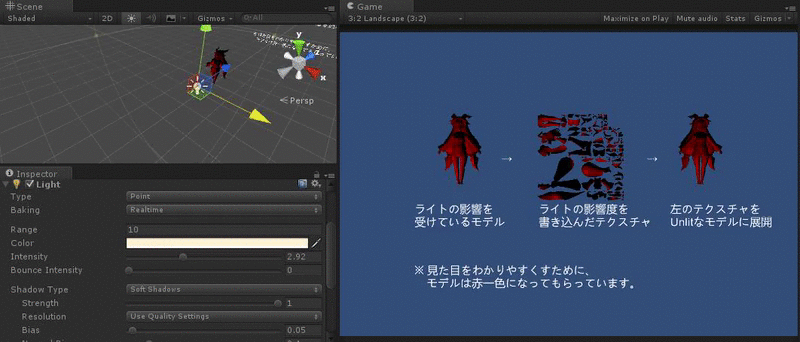
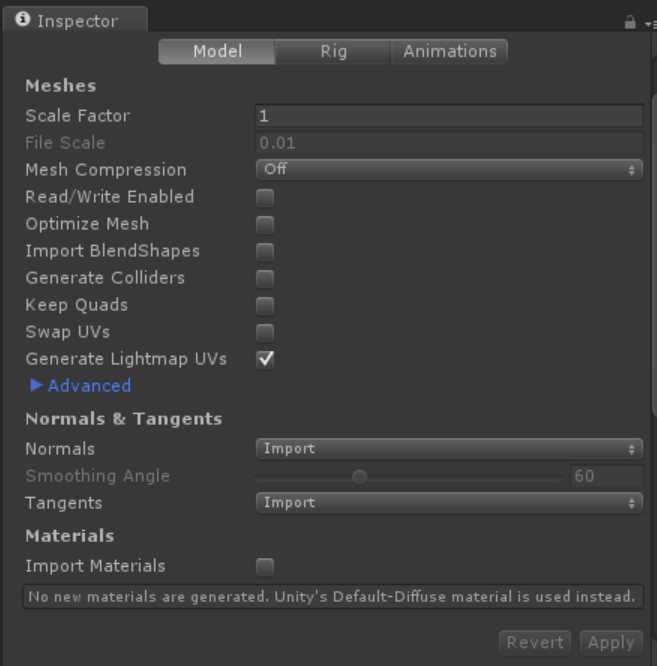

# PrebakeSystem

Unityのポイントライトを実行時にベイク出来るようにしてみたプロジェクトです 

ライトの影響度をテクスチャに書き込んで置き、あとで それを参照することで絵作りできるようになっています

使用にはLightMap用のUVを作成しないといけません。
ModelのImporterの Generate LightMap UVsをONにすることで Lightmap用のUVが作成されます。 

